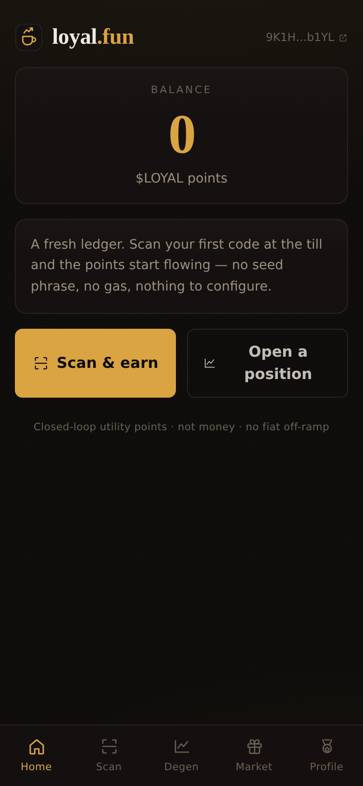
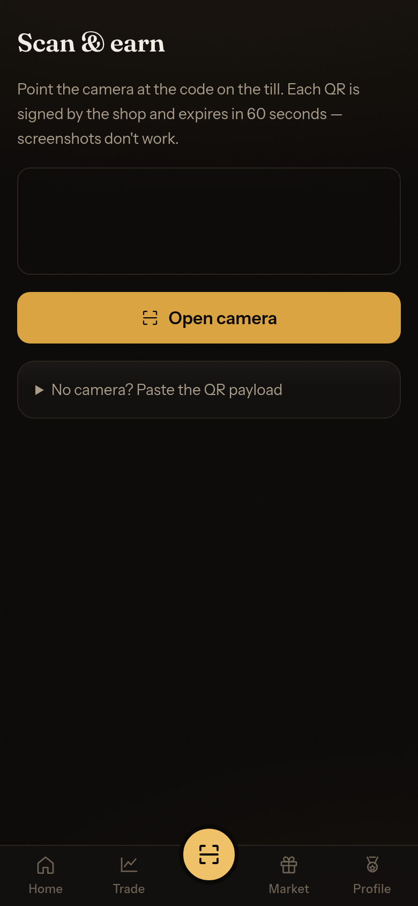
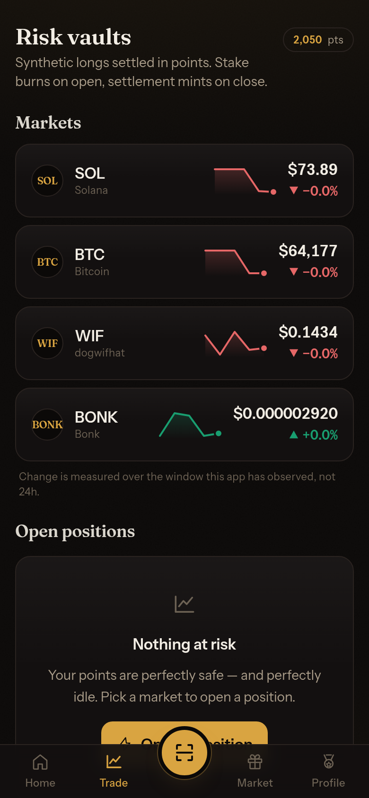
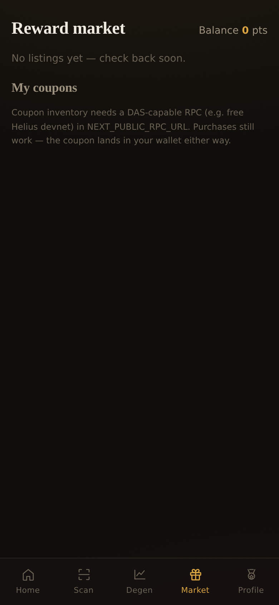
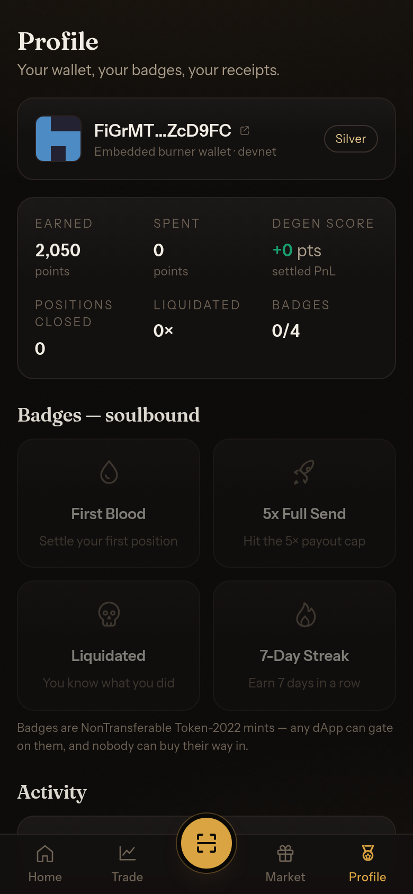
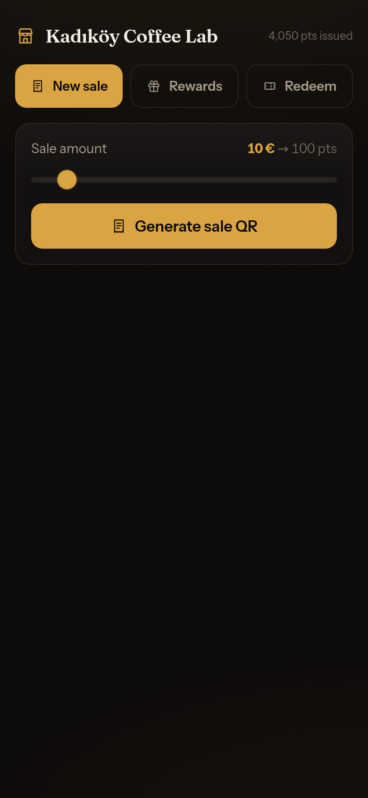
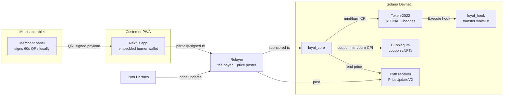

<p align="center">
  
</p>

<h1 align="center">loyal.fun</h1>

<p align="center"><b>Buy a coffee, earn points, open a BONK position with them — spend the winnings on free coffee.</b></p>

<p align="center">
  <a href="README.md">🇵🇱 Polski</a> · 🇬🇧 English (this file)
</p>

<table align="center">
  <tr>
    <td align="center" width="190">
      <a href="https://loyalfun.vercel.app"></a><br/>
      <sub><b>Customer app</b><br/>earn points, open positions<br/><code>loyalfun.vercel.app</code></sub>
    </td>
    <td align="center" width="190">
      <a href="https://loyalfun.vercel.app/demo-merchant"></a><br/>
      <sub><b>Demo till — generate sale QRs</b><br/>one tap, a fresh code every 60 s<br/><code>/demo-merchant</code></sub>
    </td>
    <td align="center" width="190">
      <a href="https://loyalfun.vercel.app/merchant"></a><br/>
      <sub><b>Merchant panel</b><br/>register, rewards, coupon redemption<br/><code>/merchant</code></sub>
    </td>
  </tr>
</table>

<p align="center"><b>Quick start (Solana Devnet — no wallet, no SOL needed):</b></p>

1. Open [`/demo-merchant`](https://loyalfun.vercel.app/demo-merchant) on a laptop — one tap registers the demo till; the 50/100/200/500 buttons render a signed, 60-second sale QR
2. On your phone open [loyalfun.vercel.app](https://loyalfun.vercel.app) → **Scan** and scan the code — or use the native camera: the QR is a deep link and opens the app by itself
3. Points land in the embedded wallet → **Degen**: a 5× BONK position → **Market**: a cNFT coupon → **Profile**: a soulbound badge
4. Running a shop? [`/merchant`](https://loyalfun.vercel.app/merchant): registration, your own sale QRs, reward listings and the coupon-redemption scanner

<p align="center"><a href="https://loyalfun.vercel.app">App</a> · <a href="https://loyalfun.vercel.app/merchant">Merchant panel</a> · <a href="https://loyalfun.vercel.app/demo-merchant">Demo till</a> · <a href="https://loyalfun.vercel.app/api/health">API status</a></p>

---

loyal.fun turns small-shop loyalty points into a living on-chain asset on Solana. Points are a **closed-loop Token-2022 mint** ($LOYAL) earned via merchant-signed QR codes, **stakeable** into synthetic Pyth-priced positions (1×/2×/5× leverage), **spendable** on real-world rewards minted as **compressed NFTs (cNFTs)**, and **collectible** as **soulbound badges** — including one for getting liquidated.

**Live demo:** [loyalfun.vercel.app](https://loyalfun.vercel.app) · customers: `/` · shop: [`/merchant`](https://loyalfun.vercel.app/merchant) · test kiosk: [`/demo-merchant`](https://loyalfun.vercel.app/demo-merchant) · **Network:** Solana Devnet

<p align="center"></p>

## Screenshots

| Home | Scan | Risk vaults |
|---|---|---|
|  |  |  |

| Reward market | Profile & badges | Merchant panel |
|---|---|---|
|  |  |  |

The customer app is in English (mobile-first PWA); the merchant dashboard lives at `/merchant` on the shop's tablet.

## 1. The friction we kill

Today's loyalty points are **static debt entries** in a merchant's database:

- **Boring.** A number that ticks up by 10 at a time — no reason to open the app.
- **Siloed.** Café points are worthless at the barber next door.
- **Opaque.** The merchant can devalue or delete them at will.

**Our mechanism:** a point becomes *an asset whose value the customer steers*. Stake points into **Risk Vaults** tracking SOL, BTC, WIF and BONK via the Pyth oracle — payout is `stake × clamp(1 + leverage × Δprice, 0, 5)`, settled by minting/burning points. No real asset is ever bought and there is no fiat off-ramp: it's a **closed-loop utility token**, which keeps the project out of exchange/e-money regulatory territory (MiCA) while keeping all of the thrill. One $LOYAL mint unites every merchant (coalition model), coupons are cNFTs **burned on redemption** (screenshot fraud is dead), and reputation is **soulbound** — the "Liquidated" badge can't be bought or sold.

## 2. Why only Solana makes this possible

- **Sub-cent fees, POS-scale throughput.** Minting 50 points on a €3 coffee only works when a transaction costs ~$0.0002 and confirms before the milk is steamed.
- **Token-2022 extensions do the heavy lifting natively:**
  - `TransferHook` — the closed loop is enforced *by the token itself* (the `loyal_hook` program rejects wallet-to-wallet transfers; points can't leak to DEXes),
  - `NonTransferable` — soulbound badges without a line of custom transfer logic,
  - `MetadataPointer` + `TokenMetadata` — branding lives inside the mint.
- **State compression (Bubblegum cNFTs).** 16k coupons cost a fraction of a SOL in rent. "Free coffee" economics don't work with regular NFTs.
- **Pyth pull oracle.** Institutional prices on-chain, with staleness and confidence checked at every open/close/liquidation.
- **Native Ed25519 program + instruction introspection.** The merchant's *off-chain* QR signature is verified *on-chain* — issuance trusts no backend of ours.

## 3. Architecture



### Accounts (all PDAs)

| Account | Seeds | Purpose |
|---|---|---|
| `Config` | `["config"]` | admin, mint, fee_bps, leverage/stake/issuance/exposure caps, `paused` |
| `Merchant` | `["merchant", authority]` | name, rotatable `qr_signer`, issuance counters, reward budget |
| `UserProfile` | `["user", wallet]` | earned/spent, streak, tier, degen_score, badge bitmaps |
| `IssuanceNonce` | `["nonce", merchant, nonce]` | replay guard — a second `init` fails |
| `RiskVault` | `["vault", symbol]` | Pyth feed id, exposure, per-position cap |
| `Position` | `["position", user, vault, id]` | stake, entry price (1e6), leverage, status |
| `RewardListing` | `["listing", merchant, id]` | title, price, stock, coupon metadata URI |
| `RedemptionReceipt` | `["receipt", asset_id]` | proof a coupon burned — one per asset, ever |
| `MockPrice` | `["mock-price", vault]` | deterministic test oracle (`mock-oracle` builds only) |

### Instructions

| Instruction | Access | Notes |
|---|---|---|
| `initialize_config` | admin | creates $LOYAL (Token-2022: TransferHook + Metadata), authority = config PDA |
| `register_merchant` / `update_merchant_signer` / `set_merchant_active` | merchant / admin | the hot QR key is rotatable |
| `issue_points` | anyone w/ a valid QR | **ed25519 introspection** + nonce PDA + expiry + per-tx cap |
| `create_vault` / `set_vault_active` | admin | binds a Pyth feed |
| `open_position` | user (CPI-friendly) | burns the stake, records entry price (staleness + confidence), exposure caps |
| `close_position` | position owner | `payout = stake × clamp(1 + L·Δ, 0, 5)`, 2% fee burned |
| `liquidate_position` | **anyone** | permissionless crank at ≤0.2×; 1% bounty; owner earns the badge |
| `create_listing` | any merchant | listings are public PDAs — other dApps can list rewards |
| `buy_reward` | user | burns the price, Bubblegum `mint_v1` CPI mints the coupon cNFT |
| `redeem_reward` | user **+** merchant | dual signature, burn CPI + `RedemptionReceipt` |
| `claim_badge` | user | lazily creates a NonTransferable mint, mints 1 |
| `set_paused` / `set_coupon_tree` | admin | emergency stop / tree wiring |

Every state change emits an Anchor event (`PointsIssued`, `PositionOpened/Closed/Liquidated`, `RewardPurchased/Redeemed`, `BadgeClaimed`).

## 4. Design tradeoffs

- **Synthetic over real assets.** Buying real BTC with points makes you an exchange (licensing, KYC). Synthetic positions keep points closed-loop — *no custody, no off-ramp* — while the price exposure (the fun part) is identical. Cost: winnings are minted, so the winning side is inflationary; it's bounded by the 5× clamp, per-position and global exposure caps, and the 2% fee burn.
- **Mint/burn escrow model.** Stakes are *burned* on open and *minted* on settlement, instead of sitting in an escrow account. Simpler invariants (supply = circulating points, always), no transfer-hook resolution for internal moves (mint/burn never invoke hooks), and the Position PDA is the audit record.
- **Transfer-hook complexity.** The hook + whitelist works, but its wiring (ExtraAccountMetaList, hook-aware clients) is the most fragile corner of Token-2022 tooling. Because the protocol itself only mints/burns, the demo remains fully functional even if a wallet can't resolve hook accounts; the documented fallback is `Permanent Delegate` + program-owned accounts.
- **Devnet Pyth feeds.** Pull-oracle updates must be *posted* before reads. The relayer posts fresh `PriceUpdateV2`s on demand (`POST /price/:symbol`); tests use the compile-time `mock-oracle` feature (never in production builds).
- **Demo-grade key management.** Burner keypairs in localStorage, the QR key on the tablet, relayer keys in env vars. Production: embedded wallets (Privy/Web3Auth) and HSM/passkey-backed merchant signers — the interfaces are already isolated.
- **Coupon→listing matching** during redemption is by title (demo). Production would bake the listing id into the coupon URI.

## 5. Devnet deployment

| Program | Address |
|---|---|
| `loyal_core` | [`CF5FkJ9GKoFk3SMkBZuXgGnXwfN6TETs5eAYS7V6gggr`](https://explorer.solana.com/address/CF5FkJ9GKoFk3SMkBZuXgGnXwfN6TETs5eAYS7V6gggr?cluster=devnet) |
| `loyal_hook` | [`CjEcibq2LtkMJHEZ6wiiFFRNPXC4rd5xaCdEowWqW5GM`](https://explorer.solana.com/address/CjEcibq2LtkMJHEZ6wiiFFRNPXC4rd5xaCdEowWqW5GM?cluster=devnet) |

### Demo transactions

`scripts/seed_demo.ts` runs the full loop and prints this table ready to paste:

| Action | Transaction |
|---|---|
| `issue_points` (+2000 $LOYAL, signed QR) | [`3XN52mFq…`](https://explorer.solana.com/tx/3XN52mFqXrNoYuJKv1vLPv9p6vo8GAk5XpN8yDFHi1iR1mFh1ScmiyCXUDgSxgHUPe3Toq5VfAUtJLYaJnY8uvXV?cluster=devnet) |
| `open_position` (5× long BONK, 1000 pts, Pyth price) | [`4vqQunBh…`](https://explorer.solana.com/tx/4vqQunBhGo6QtMP1ujy8nQsD7VhDFkPFKHEXL2oDuHaDPrexfKK9XfBZvsTUB1t1C7vTwLYbwWvMN2kTm4VswSMh?cluster=devnet) |
| `close_position` (PnL settled, 2% burned) | [`2BUKdfvo…`](https://explorer.solana.com/tx/2BUKdfvopagkU1DKTKZ5GZNz7uFaBvQrzDA7uVhhfcENTE6BptbNTX1Rczs6VWqc4S4VrUtarPA6vcQcSb7gYg7i?cluster=devnet) |
| `buy_reward` ("1 Free Coffee" coupon as a cNFT) | [`1dTEdBAt…`](https://explorer.solana.com/tx/1dTEdBAt4JWbQV5r8ohipwSuMQjmeQH8YMBit6oMDMWLbh8Vh4z1ykFabtSLirLmXbmNHhkx3n7aweu7zRn1zDu?cluster=devnet) |
| `claim_badge` ("First Blood", soulbound Token-2022) | [`2q5ECBmn…`](https://explorer.solana.com/tx/2q5ECBmnjx5XqZ5djAEorJG1LMqdeHgTKcPQXqNBWvu14iBg5cusC5r8k9Ujcw16KJwzPs21Xxfc63J8MViKbsum?cluster=devnet) |
| `register_merchant` ("Kadıköy Coffee Lab") | [`3ER1byXs…`](https://explorer.solana.com/tx/3ER1byXsr9uxij9pBaHenLki8EGSW4eNFjcqYFoFij9uCzzS2TQ9dN1eWMj2YRpP9CkMHEf9DCZ3DPVCHUGcWhRV?cluster=devnet) |
| `create_vault` (BONK, Pyth feed) | [`2sQahaiU…`](https://explorer.solana.com/tx/2sQahaiUwQMX7X4nB58GwhbSPaaYNG71n7WA6asR3u7bXCEVX7sRhi2d9U8RuAVDBCitWUR5NDjHM64tp4cKSB7X?cluster=devnet) |
Coupon redemption (`redeem_reward`, dual signature + cNFT burn) is exercised in-app at the till — see section 7.4.

| Asset | Address |
|---|---|
| $LOYAL mint (Token-2022) | [`DAP9CzagNJWbe1xAv878dA9iqLqs25jvyLxRBNtQGuUj`](https://explorer.solana.com/address/DAP9CzagNJWbe1xAv878dA9iqLqs25jvyLxRBNtQGuUj?cluster=devnet) |
| Coupon tree (Bubblegum) | [`55LzrjDNE8gqmqaArAZPrYmmwvAzoCkRuyst9kwDGAoC`](https://explorer.solana.com/address/55LzrjDNE8gqmqaArAZPrYmmwvAzoCkRuyst9kwDGAoC?cluster=devnet) |

## 6. Install & run

Prerequisites: Rust, Solana CLI ≥ 1.18, Anchor **0.31.1**, Node 20+.

```bash
npm install

# Programs
anchor build                      # for tests: anchor build -- --features mock-oracle
cargo test                        # Rust unit tests: PnL math, price scaling (15)
npm run test:unit                 # TS mirror of the settlement math (11)
anchor test --skip-build          # integration suite on a local validator

# Devnet
anchor deploy --provider.cluster devnet
npx ts-node scripts/deploy.ts          # config + mint + hook whitelist + coupon tree + demo merchant
npx ts-node scripts/create_vaults.ts   # SOL / BTC / WIF / BONK vaults
npx ts-node scripts/seed_demo.ts       # full happy path, prints Explorer links
npm run sync-idl                       # copies the IDL into the app

# Services (local)
cp app/.env.local.example app/.env.local
npm run app                            # :3000 (customer) + /merchant (shop tablet)
# optional standalone relayer for development:
cp relayer/.env.example relayer/.env && npm run relayer   # :8787
```

### Hosting (Vercel) — one deployment, no extra services

The Vercel project points at the `app/` directory. **The relayer is built
in** as serverless routes: `/api/sponsor` (fee-payer co-signing with a
program whitelist), `/api/price/:symbol` (posts fresh Pyth prices),
`/api/fund` (tops up burner wallets with a sliver of SOL for account rent —
the relayer pays fees, but `init` rent is debited from the user) and
`/api/health`. The only required environment variable:

| Variable | Value |
|---|---|
| `FEE_PAYER_SECRET` | a devnet keypair holding a little SOL (JSON array or base58) |

Sale QRs are **deep links** (`/scan?d=…`) — a phone's native camera reads
them too and opens the app straight on the Scan page.

## 7. How to test the system (step by step)

### 7.1. Quick local tests (no devnet needed)

```bash
cargo test               # 15 tests: PnL (win/loss/clamps/fee), liquidation thresholds, Pyth scaling
npm run test:unit        # 11 TS tests — same vectors as on-chain, catches client/program drift
anchor build -- --features mock-oracle
anchor test --skip-build # integration: QR (replay/expiry/bad signer/tampered payload/cap),
                         # positions (5× win, 2× loss, clamp, fee), liquidation + bounty, pause
```

### 7.2. Deploy wallet (you hold devnet SOL in Phantom)

**Recommended: a fresh CLI wallet + a transfer from Phantom.** Phantom's secrets never touch the terminal:

```bash
solana-keygen new -o ~/.config/solana/id.json   # save the phrase it prints
solana config set --url devnet
solana address                                   # copy this address
```

In Phantom, switch the network to **Devnet** (Settings → Developer Settings → Testnet Mode / network picker), send **3–4 SOL** to the copied address, then verify:

```bash
solana balance --url devnet                      # should show the transferred SOL
```

<details>
<summary>Alternatives: import an existing Phantom account (recovery phrase or private key)</summary>

**Recovery phrase (12/24 words):**

```bash
# 1. Print the addresses derived on Phantom's path (m/44'/501'/<i>'/0'):
npx ts-node scripts/mnemonic_to_keypair.ts "word1 word2 ... word12"
# 2. Pick the index matching your Phantom account and write it:
npx ts-node scripts/mnemonic_to_keypair.ts "word1 ... word12" 0 ~/.config/solana/id.json
```

**Private key (base58)** — Phantom: Settings → Manage Accounts → (account) → Show Private Key:

```bash
npx ts-node scripts/phantom_to_keypair.ts <BASE58_KEY> ~/.config/solana/id.json
```

After importing: `solana address` must print your Phantom address; finish with `history -c` — you pasted a secret into the terminal. Use a devnet-only wallet.

</details>

### 7.3. Full devnet test

1. **Deploy + bootstrap** — section 6 (`anchor deploy`, `deploy.ts`, `create_vaults.ts`).
2. **Seed demo:** `RPC_URL=https://devnet.helius-rpc.com/?api-key=<KEY> npx ts-node scripts/seed_demo.ts` — coupon redemption needs a DAS-capable RPC (free Helius devnet); without one the redeem step is skipped with a warning.
3. **Relayer:** fill `relayer/.env` (`FEE_PAYER_SECRET` = a keypair holding devnet SOL, plus `MERCHANT_PDA` and `MERCHANT_QR_SECRET` from the `deploy.ts` output), then `npm run relayer`. Check: `curl localhost:8787/health`.
4. **App:** fill `app/.env.local` (DAS RPC, relayer URL), `npm run sync-idl`, `npm run app`.

### 7.4. Clicking through the app (two devices, or two browser windows)

> **Quick start:** open **`/demo-merchant`** — a kiosk-style testing shortcut.
> One tap registers a throwaway "Demo Till" merchant on-chain, and the
> 50 / 100 / 200 / 500 buttons instantly render a signed, 60-second sale QR.
> Scan it with the customer app (Scan tab) on another device — no merchant
> panel setup needed.

**Window A — the shop (`/merchant`):**
1. Register the shop (one click; fees go through the relayer).
2. **Rewards** tab — create a listing, e.g. "1 Free Coffee" for 500 pts.
3. **New sale** tab — set the amount (€10 → 100 pts) and generate the QR. The code lives for 60 s.

**Window B — the customer (home page):**
4. **Scan & earn** — scan the QR from window A (no camera? "Paste the QR payload"). You should see `+100 LOYAL` and an Activity entry linking to the Explorer.
5. Try scanning the **same** QR again → the transaction must be rejected (nonce replay guard).
6. **Degen** — pick a vault, set stake and 5× leverage, open a position; watch live PnL and the liquidation line; close it. The balance changes by `clamp(1+5Δ,0,5)` minus the 2% fee.
7. **Market** — buy a coupon; it appears under "My coupons" (needs the DAS RPC).
8. Tap the coupon → a redemption QR appears (a partially-signed transaction, valid ~60–90 s).

**Window A — the shop:**
9. **Redeem** tab — scan the customer's QR. The coupon burns on-chain; the "Redeemed" counter increments. The same coupon will not pass twice.

**Window B — the customer:**
10. **Profile** — claim the "First Blood" badge (unlocked by your first settled position). It's NonTransferable — try sending it from any wallet and watch the transfer fail.

### 7.5. On-chain verification (Explorer, cluster=devnet)

- The `issue_points` transaction: instruction #1 is the native **Ed25519 verify**, #2 is the program; logs contain `PointsIssued`.
- The $LOYAL mint: **TransferHook** and **TokenMetadata** extensions visible on the token page.
- After `close_position`: the event in the logs shows `fee_burned` > 0; mint supply drops by the fee.
- After `redeem_reward`: a `RedemptionReceipt` PDA exists for the coupon's asset id; a second redeem fails with `already in use`.
- A badge: a mint with the **NonTransferable** extension, decimals 0, balance 1.

## 8. Composability

- **One mint, many merchants.** Every registered shop issues and honors the same $LOYAL; `create_listing` is open to all.
- **Open CPI surface.** `open_position` / `buy_reward` need no privileged signers — any game can CPI in. `liquidate_position` is a permissionless crank with a 1% bounty for keeper bots.
- **Events as an API.** Leaderboards and quest systems index events without reading accounts.
- **Standards over registries.** Badges are readable by any token-gating tool; coupons show up in any DAS-indexed wallet.

## Repository layout

```
programs/loyal_core/   main Anchor program (points, vaults, market, badges)
programs/loyal_hook/   Token-2022 transfer hook (closed-loop whitelist)
app/                   Next.js 14 PWA — customer app + /merchant
relayer/               fee payer + QR signing + Pyth price posting (Express)
tests/                 integration suite + deterministic PnL unit tests
scripts/               deploy / create_vaults / seed_demo / phantom_to_keypair
docs/screenshots/      screenshots used above
keys/                  devnet program keypairs (intentionally committed, demo grade)
```

*Closed-loop utility token. Not money. No fiat off-ramp.*
