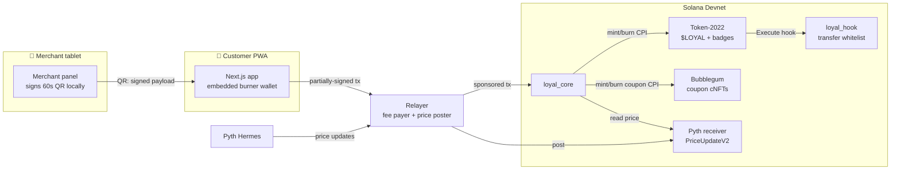

# loyal.fun 🎰☕

> **Buy a coffee, earn points, long BONK with them, spend the wins on free coffee.**

loyal.fun turns small-shop loyalty points into a living on-chain asset. Points are a **closed-loop Token-2022 mint** ($LOYAL) earned via merchant-signed QR codes, **degen-able** into synthetic Pyth-priced positions with 1x/2x/5x leverage, **spendable** on real-world rewards minted as **compressed-NFT coupons**, and **flexable** as **soulbound achievement badges** — including one for getting liquidated. 💀

*Demo GIF placeholder — 90-second run-through: QR scan → +200 pts → 5x BONK long → close in profit → buy coffee coupon → burn-to-redeem at the till → "First Blood" badge drops.*

**Live demo:** *URL placeholder (Vercel)* · **Network:** Solana Devnet

---

## 1. The friction we kill

Loyalty points today are **siloed static debt entries** in a merchant's database:

- **Boring.** A number that only goes up by 10 at a time. No reason to open the app.
- **Siloed.** Café points are worthless at the barber next door.
- **Opaque.** The merchant can devalue, expire, or delete them at will.

**Our novel mechanism:** points become a *live asset whose value the customer controls*. Stake them into **Risk Vaults** that track real asset prices (SOL, BTC, WIF, BONK) via Pyth — payout = `stake × clamp(1 + leverage × Δprice, 0, 5)`, settled by minting/burning points. No real asset is ever bought, no fiat off-ramp exists: it's a **closed-loop utility token**, which is exactly what keeps it out of exchange/e-money regulatory territory while keeping 100% of the dopamine. One $LOYAL mint is shared by every merchant (coalition model), coupons are cNFTs that **burn on redemption** (screenshot fraud is dead), and reputation is **soulbound** — your "Got Liquidated 💀" badge is forever.

Retention stops being a discount program and becomes a game people *choose* to play.

## 2. Why only Solana makes this possible

- **Sub-cent fees, POS-scale throughput.** Issuing 50 points on a $3 coffee only works if the transaction costs ~$0.0002 and confirms while the milk is being steamed.
- **Token-2022 extensions do the heavy lifting natively:**
  - `TransferHook` → the closed loop is enforced *by the token itself* (wallet-to-wallet transfers are rejected by the `loyal_hook` whitelist program; no DEX dumping, no OTC karaborsa).
  - `NonTransferable` → soulbound badges without a single line of custom transfer logic.
  - `MetadataPointer` + `TokenMetadata` → branding lives inside the mint.
- **State compression (Bubblegum cNFTs).** 16k coupons cost well under 1 SOL of rent, total. Coupon economics at "free coffee" scale are impossible with regular NFTs.
- **Pyth pull oracle.** Sub-second institutional prices on-chain, with staleness and confidence checked at every open/close/liquidation.
- **Ed25519 native program + instruction introspection.** The merchant's *off-chain* QR signature is verified *on-chain* — no backend of ours is trusted for issuance.

## 3. Architecture



### Accounts (all PDAs)

| Account | Seeds | Purpose |
|---|---|---|
| `Config` | `["config"]` | admin, mint, fee_bps, leverage/stake/issuance/exposure caps, `paused` |
| `Merchant` | `["merchant", authority]` | name, rotating `qr_signer`, issuance counters, reward budget |
| `UserProfile` | `["user", wallet]` | earned/spent, streak, tier, degen_score, badge bitmaps |
| `IssuanceNonce` | `["nonce", merchant, nonce]` | replay guard — `init` fails on second use |
| `RiskVault` | `["vault", symbol]` | Pyth feed id, exposure, per-position cap |
| `Position` | `["position", user, vault, id]` | stake, entry price (1e6), leverage, status |
| `RewardListing` | `["listing", merchant, id]` | title, price, stock, coupon metadata URI |
| `RedemptionReceipt` | `["receipt", asset_id]` | proof a coupon burned — one per asset, ever |
| `MockPrice` | `["mock-price", vault]` | deterministic test oracle (`mock-oracle` builds only) |

### Instructions

| Instruction | Access | Notes |
|---|---|---|
| `initialize_config` | admin | creates $LOYAL (Token-2022: TransferHook + Metadata), authority = config PDA |
| `register_merchant` / `update_merchant_signer` / `set_merchant_active` | merchant / admin | hot QR key is rotatable |
| `issue_points` | anyone w/ valid QR | **ed25519 introspection** + nonce PDA + expiry + per-tx cap |
| `create_vault` / `set_vault_active` | admin | binds a Pyth feed id |
| `open_position` | user (CPI-friendly) | burns stake, records Pyth entry (staleness + confidence checked), exposure caps |
| `close_position` | position owner | `payout = stake × clamp(1 + L·Δ, 0, 5)`, 2% fee burned, mints net |
| `liquidate_position` | **anyone** | permissionless crank at ≤0.2x; 1% bounty; owner earns 💀 badge |
| `create_listing` | any merchant | listings are public PDAs — other dApps can list rewards |
| `buy_reward` | user | burns price, Bubblegum `mint_v1` CPI mints coupon cNFT |
| `redeem_reward` | user **+** merchant | dual-signature burn CPI + `RedemptionReceipt` |
| `claim_badge` | user | lazily creates a NonTransferable Token-2022 badge mint, mints 1 |
| `set_paused` / `set_coupon_tree` | admin | emergency stop / tree wiring |

Every state change emits an Anchor event (`PointsIssued`, `PositionOpened/Closed/Liquidated`, `RewardPurchased/Redeemed`, `BadgeClaimed`) for indexers and composers.

## 4. Tradeoffs & constraints (what we chose and why)

- **Synthetic vs real assets.** Buying real BTC/memecoins with points makes you an exchange (MiCA, licensing, KYC). Synthetic positions keep points closed-loop — *no custody, no off-ramp, no order books* — while price exposure (the fun part) is identical. Tradeoff: winnings are minted, so the token is inflationary on the win side; controlled by the 5x clamp, per-position and global exposure caps, and the 2% settlement fee burn (net deflationary pressure on every settle).
- **Mint/burn escrow model.** Stakes are *burned* on open and settlements *minted* on close, instead of held in an escrow token account. Simpler invariants (supply = circulating points, always), no transfer-hook resolution needed for program-internal moves (mint/burn bypass hooks by design), and the Position PDA is the audit record.
- **Transfer-hook complexity.** The hook + whitelist works, but the wiring (ExtraAccountMetaList, hook-aware clients) is the most fragile part of Token-2022 tooling. Because the protocol itself only mints/burns, the demo remains fully functional even if a wallet can't resolve hook accounts; the fallback design (documented, not silently dropped) would be `Permanent Delegate` + program-owned accounts.
- **Devnet Pyth feeds.** Pull-oracle updates must be *posted* before reads. The relayer posts fresh `PriceUpdateV2`s on demand (`POST /price/:symbol`); tests use a compile-time `mock-oracle` feature (never in release builds) for deterministic PnL vectors.
- **Demo-grade key management.** Burner keypairs in localStorage, QR-signer on the tablet, relayer keys in env vars. Production: Privy/Web3Auth embedded wallets, HSM/passkey-backed merchant signers — the interfaces are already isolated (`lib/wallet.ts`, relayer).
- **Coupon→listing matching** in the redemption flow is by title (demo). Production would bake the listing id into the cNFT URI.

## 5. Devnet deployment

| Program | Address |
|---|---|
| `loyal_core` | [`CF5FkJ9GKoFk3SMkBZuXgGnXwfN6TETs5eAYS7V6gggr`](https://explorer.solana.com/address/CF5FkJ9GKoFk3SMkBZuXgGnXwfN6TETs5eAYS7V6gggr?cluster=devnet) |
| `loyal_hook` | [`CjEcibq2LtkMJHEZ6wiiFFRNPXC4rd5xaCdEowWqW5GM`](https://explorer.solana.com/address/CjEcibq2LtkMJHEZ6wiiFFRNPXC4rd5xaCdEowWqW5GM?cluster=devnet) |

### Demo transactions

`scripts/seed_demo.ts` runs the full loop and prints this table ready to paste:

| Action | Transaction |
|---|---|
| `issue_points` (+2000 $LOYAL via signed QR) | *run `npm run seed:devnet`* |
| `open_position` (5x long BONK) | *…* |
| `close_position` (PnL settled, 2% burned) | *…* |
| `buy_reward` (coffee coupon cNFT minted) | *…* |
| `redeem_reward` (coupon burned + receipt) | *…* |
| `claim_badge` ("First Blood" soulbound) | *…* |

> ⚠️ Replace this table with the actual `seed_demo.ts` output after deploying — the script prints exactly these rows with live Explorer links.

## 6. Running it

```bash
# Prereqs: Rust, Solana CLI ≥1.18, Anchor 0.31.1, Node 20+
npm install

# Programs
anchor build                      # or: anchor build -- --features mock-oracle (for tests)
cargo test                        # Rust unit tests: PnL math, oracle scaling (15 tests)
npm run test:unit                 # TS mirror of the settlement math (11 tests)
anchor test --skip-build          # integration suite on a local validator (mock oracle)

# Devnet
anchor deploy --provider.cluster devnet
npx ts-node scripts/deploy.ts     # config + mint + hook whitelist + coupon tree + demo merchant
npx ts-node scripts/create_vaults.ts   # SOL / BTC / WIF / BONK vaults
npx ts-node scripts/seed_demo.ts       # full happy path, prints Explorer links
npm run sync-idl                  # copies target/idl into the app

# Services
cp relayer/.env.example relayer/.env   # add FEE_PAYER_SECRET + values printed by deploy.ts
npm run relayer                        # :8787
cp app/.env.local.example app/.env.local
npm run app                            # :3000 (customer) + /merchant (shop tablet)
```

**Test coverage:** ed25519 QR verification (happy path, replay, expiry, wrong signer, tampered payload, cap), PnL math (win/loss/clamps/fee/rounding, on-chain and client mirrored), liquidation threshold + permissionless crank + bounty, listing creation, pause switch.

## 7. Composability

loyal.fun is deliberately a *platform*, not an app:

- **One mint, many merchants.** Any registered shop issues and honors the same $LOYAL. `create_listing` is open to every merchant — a barber can list "free fade" next to the café's espresso.
- **Open CPI surface.** `open_position` / `close_position` / `buy_reward` take no privileged signers beyond the user: any game or dApp can CPI in and let players stake loyalty points ("spin the wheel" games, in-app boosts). `liquidate_position` is a permissionless crank — keeper bots earn 1% by watching Pyth.
- **Events as an API.** Every action emits a typed Anchor event; leaderboards, analytics and quest systems can index without touching accounts.
- **Standards, not custom registries.** Badges are plain NonTransferable Token-2022 mints — any token-gating tool (Discord bots, allowlists) reads them today. Coupons are standard Bubblegum cNFTs — visible in any DAS-indexed wallet.
- **Public read model.** Listings, vaults, positions and profiles are all deterministic PDAs documented above; forks and frontends need no permission.

---

### Repo layout

```
programs/loyal_core/   main Anchor program (points, vaults, marketplace, badges)
programs/loyal_hook/   Token-2022 transfer hook (closed-loop whitelist)
app/                   Next.js 14 PWA — customer app + /merchant dashboard
relayer/               fee-payer + QR signer + Pyth price poster (Express)
tests/                 integration suite + deterministic PnL unit tests
scripts/               deploy / create_vaults / seed_demo (prints Explorer links)
keys/                  devnet program keypairs (demo-grade, intentionally committed)
```

*Closed-loop utility token. Not money. No fiat off-ramp. DYOR on your own coffee.* ☕
