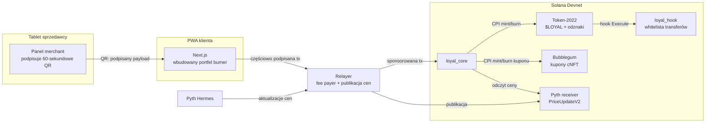

<p align="center">
  
</p>

<h1 align="center">loyal.fun</h1>

<p align="center"><b>Kupujesz kawę, zbierasz punkty, otwierasz nimi pozycję na BONK — wygraną płacisz za darmową kawę.</b></p>

<p align="center">
  🇵🇱 Polski (ten plik) · <a href="README.en.md">🇬🇧 English</a>
</p>

---

loyal.fun zamienia punkty lojalnościowe małych sklepów w żywe aktywo na Solanie. Punkty to **zamknięty obieg Token-2022** ($LOYAL) zdobywany przez podpisane kody QR sprzedawcy, **stakowalny** w syntetyczne pozycje wyceniane oraklem Pyth (dźwignia 1×/2×/5×), **wydawalny** na prawdziwe nagrody bite jako **skompresowane NFT (cNFT)** i **kolekcjonowalny** jako odznaki **soulbound** — łącznie z odznaką za likwidację pozycji.

**Live demo:** [loyalfun.vercel.app](https://loyalfun.vercel.app) · **Sieć:** Solana Devnet

## Zrzuty ekranu

| Start | Skanowanie | Risk vaults |
|---|---|---|
|  |  |  |

| Market nagród | Profil i odznaki | Panel sprzedawcy |
|---|---|---|
|  |  |  |

Aplikacja kliencka jest w języku angielskim (PWA, mobile-first); dashboard sprzedawcy działa pod `/merchant` na tablecie sklepu.

## 1. Problem, który rozwiązujemy

Dzisiejsze punkty lojalnościowe to **statyczne zapisy długu** w bazie sprzedawcy:

- **Nudne.** Licznik rośnie o 10 na raz — nie ma powodu, żeby otwierać aplikację.
- **Zamknięte w silosach.** Punkty z kawiarni są bezwartościowe u fryzjera obok.
- **Nieprzejrzyste.** Sprzedawca może je w każdej chwili zdewaluować albo skasować.

**Nasz mechanizm:** punkt staje się *aktywem, którego wartością steruje klient*. Wpłacasz punkty do **Risk Vaults** śledzących ceny SOL, BTC, WIF i BONK przez orakl Pyth — wypłata to `stake × clamp(1 + dźwignia × Δceny, 0, 5)`, rozliczana mintem/burnem punktów. Żadne prawdziwe aktywo nie jest kupowane, nie ma wypłaty do fiata: to **token użytkowy w zamkniętym obiegu**, co trzyma projekt z dala od reżimu giełdowego (MiCA), a zostawia całą frajdę. Jeden mint $LOYAL łączy wszystkich sprzedawców (model koalicyjny), kupony to cNFT **palone przy realizacji** (koniec z oszustwem na zrzut ekranu), a reputacja jest **soulbound** — odznaki „Liquidated" nie da się kupić ani sprzedać.

## 2. Dlaczego tylko Solana to umożliwia

- **Opłaty poniżej centa i przepustowość klasy POS.** Mint 50 punktów przy kawie za 3 € ma sens tylko przy koszcie ~0,0002 $ i potwierdzeniu, zanim barista spieni mleko.
- **Rozszerzenia Token-2022 robią całą robotę natywnie:**
  - `TransferHook` — zamknięty obieg egzekwuje *sam token* (program `loyal_hook` odrzuca transfery portfel→portfel; punktów nie da się wywieźć na DEX),
  - `NonTransferable` — odznaki soulbound bez linijki własnej logiki transferu,
  - `MetadataPointer` + `TokenMetadata` — branding wewnątrz minta.
- **Kompresja stanu (Bubblegum cNFT).** 16 tysięcy kuponów kosztuje ułamek SOL czynszu. Ekonomia „darmowej kawy" nie spina się ze zwykłymi NFT.
- **Pyth pull oracle.** Instytucjonalne ceny on-chain, ze sprawdzaną świeżością i przedziałem ufności przy każdym otwarciu/zamknięciu/likwidacji.
- **Natywny program Ed25519 + introspekcja instrukcji.** Podpis QR sprzedawcy złożony *off-chain* jest weryfikowany *on-chain* — emisja punktów nie ufa żadnemu naszemu backendowi.

## 3. Architektura



### Konta (wszystkie PDA)

| Konto | Seeds | Rola |
|---|---|---|
| `Config` | `["config"]` | admin, mint, fee_bps, limity dźwigni/stake'a/emisji/ekspozycji, `paused` |
| `Merchant` | `["merchant", authority]` | nazwa, rotowalny `qr_signer`, liczniki emisji, budżet nagród |
| `UserProfile` | `["user", wallet]` | earned/spent, streak, tier, degen_score, bitmapy odznak |
| `IssuanceNonce` | `["nonce", merchant, nonce]` | ochrona przed replay — drugi `init` się nie uda |
| `RiskVault` | `["vault", symbol]` | id feedu Pyth, ekspozycja, limit na pozycję |
| `Position` | `["position", user, vault, id]` | stake, cena wejścia (1e6), dźwignia, status |
| `RewardListing` | `["listing", merchant, id]` | tytuł, cena, stan, URI metadanych kuponu |
| `RedemptionReceipt` | `["receipt", asset_id]` | dowód spalenia kuponu — jeden na asset, na zawsze |
| `MockPrice` | `["mock-price", vault]` | deterministyczny orakl testowy (tylko build `mock-oracle`) |

### Instrukcje

| Instrukcja | Dostęp | Uwagi |
|---|---|---|
| `initialize_config` | admin | tworzy $LOYAL (Token-2022: TransferHook + Metadata), authority = config PDA |
| `register_merchant` / `update_merchant_signer` / `set_merchant_active` | merchant / admin | gorący klucz QR można rotować |
| `issue_points` | każdy z ważnym QR | **introspekcja ed25519** + nonce PDA + expiry + limit na tx |
| `create_vault` / `set_vault_active` | admin | wiąże feed Pyth |
| `open_position` | użytkownik (przyjazne CPI) | pali stake, zapisuje cenę wejścia (świeżość + ufność), limity ekspozycji |
| `close_position` | właściciel pozycji | `payout = stake × clamp(1 + L·Δ, 0, 5)`, 2% fee spalane |
| `liquidate_position` | **każdy** | permissionless crank przy ≤0,2×; 1% bounty; właściciel dostaje odznakę |
| `create_listing` | każdy merchant | listingi to publiczne PDA — inne dAppy mogą wystawiać nagrody |
| `buy_reward` | użytkownik | pali cenę, CPI Bubblegum `mint_v1` bije kupon cNFT |
| `redeem_reward` | użytkownik **+** merchant | podwójny podpis, burn CPI + `RedemptionReceipt` |
| `claim_badge` | użytkownik | leniwie tworzy mint NonTransferable, bije 1 sztukę |
| `set_paused` / `set_coupon_tree` | admin | wyłącznik awaryjny / podpięcie drzewa |

Każda zmiana stanu emituje event Anchora (`PointsIssued`, `PositionOpened/Closed/Liquidated`, `RewardPurchased/Redeemed`, `BadgeClaimed`).

## 4. Kompromisy projektowe

- **Syntetyki zamiast prawdziwych aktywów.** Kupowanie prawdziwego BTC za punkty robi z projektu giełdę (licencje, KYC). Pozycje syntetyczne trzymają punkty w zamkniętym obiegu — *bez custody, bez off-rampu* — a ekspozycja cenowa (czyli emocje) jest identyczna. Koszt: wygrane są mintowane, więc strona wygrywająca jest inflacyjna; kontrolują to clamp 5×, limity ekspozycji per pozycja i globalne oraz spalane 2% fee.
- **Model escrow mint/burn.** Stake jest *palony* przy otwarciu i *mintowany* przy rozliczeniu, zamiast leżeć na koncie escrow. Prostsze inwarianty (podaż = punkty w obiegu, zawsze), zero rozwiązywania transfer-hooków w ruchach wewnętrznych (mint/burn ich nie wywołuje), a PDA pozycji jest zapisem audytowym.
- **Złożoność transfer-hooka.** Hook z whitelistą działa, ale okablowanie (ExtraAccountMetaList, klienci świadomi hooków) to najkruchszy region narzędzi Token-2022. Ponieważ protokół sam tylko mintuje/pali, demo działa nawet gdy portfel nie umie rozwiązać kont hooka; udokumentowany fallback to `Permanent Delegate` + konta programowe.
- **Feedy Pyth na devnecie.** Aktualizacje pull-oracle trzeba najpierw *opublikować*. Relayer publikuje świeże `PriceUpdateV2` na żądanie (`POST /price/:symbol`); testy używają kompilowanej flagi `mock-oracle` (nigdy w buildzie produkcyjnym).
- **Klucze klasy demo.** Burner w localStorage, klucz QR na tablecie, klucze relayera w env. Produkcja: portfele embedded (Privy/Web3Auth), podpisy sprzedawcy w HSM/passkey — interfejsy są już odseparowane.
- **Dopasowanie kupon→listing** przy realizacji jest po tytule (demo). Produkcyjnie id listingu trafiłoby do URI kuponu.

## 5. Wdrożenie na devnecie

| Program | Adres |
|---|---|
| `loyal_core` | [`CF5FkJ9GKoFk3SMkBZuXgGnXwfN6TETs5eAYS7V6gggr`](https://explorer.solana.com/address/CF5FkJ9GKoFk3SMkBZuXgGnXwfN6TETs5eAYS7V6gggr?cluster=devnet) |
| `loyal_hook` | [`CjEcibq2LtkMJHEZ6wiiFFRNPXC4rd5xaCdEowWqW5GM`](https://explorer.solana.com/address/CjEcibq2LtkMJHEZ6wiiFFRNPXC4rd5xaCdEowWqW5GM?cluster=devnet) |

### Transakcje demo

`scripts/seed_demo.ts` wykonuje pełną pętlę i drukuje poniższą tabelę gotową do wklejenia:

| Akcja | Transakcja |
|---|---|
| `issue_points` (+2000 $LOYAL, podpisany QR) | [`3XN52mFq…`](https://explorer.solana.com/tx/3XN52mFqXrNoYuJKv1vLPv9p6vo8GAk5XpN8yDFHi1iR1mFh1ScmiyCXUDgSxgHUPe3Toq5VfAUtJLYaJnY8uvXV?cluster=devnet) |
| `open_position` (5× long BONK, 1000 pkt, cena z Pyth) | [`4vqQunBh…`](https://explorer.solana.com/tx/4vqQunBhGo6QtMP1ujy8nQsD7VhDFkPFKHEXL2oDuHaDPrexfKK9XfBZvsTUB1t1C7vTwLYbwWvMN2kTm4VswSMh?cluster=devnet) |
| `close_position` (rozliczenie PnL, 2% spalone) | [`2BUKdfvo…`](https://explorer.solana.com/tx/2BUKdfvopagkU1DKTKZ5GZNz7uFaBvQrzDA7uVhhfcENTE6BptbNTX1Rczs6VWqc4S4VrUtarPA6vcQcSb7gYg7i?cluster=devnet) |
| `buy_reward` (kupon "1 Free Coffee" jako cNFT) | [`1dTEdBAt…`](https://explorer.solana.com/tx/1dTEdBAt4JWbQV5r8ohipwSuMQjmeQH8YMBit6oMDMWLbh8Vh4z1ykFabtSLirLmXbmNHhkx3n7aweu7zRn1zDu?cluster=devnet) |
| `claim_badge` („First Blood", soulbound Token-2022) | [`2q5ECBmn…`](https://explorer.solana.com/tx/2q5ECBmnjx5XqZ5djAEorJG1LMqdeHgTKcPQXqNBWvu14iBg5cusC5r8k9Ujcw16KJwzPs21Xxfc63J8MViKbsum?cluster=devnet) |
| `register_merchant` („Kadıköy Coffee Lab") | [`3ER1byXs…`](https://explorer.solana.com/tx/3ER1byXsr9uxij9pBaHenLki8EGSW4eNFjcqYFoFij9uCzzS2TQ9dN1eWMj2YRpP9CkMHEf9DCZ3DPVCHUGcWhRV?cluster=devnet) |
| `create_vault` (BONK, feed Pyth) | [`2sQahaiU…`](https://explorer.solana.com/tx/2sQahaiUwQMX7X4nB58GwhbSPaaYNG71n7WA6asR3u7bXCEVX7sRhi2d9U8RuAVDBCitWUR5NDjHM64tp4cKSB7X?cluster=devnet) |
Realizacja kuponu (`redeem_reward`, podwójny podpis + spalenie cNFT) jest wykonywana w aplikacji przy ladzie — sekcja 7.4.

| Zasób | Adres |
|---|---|
| Mint $LOYAL (Token-2022) | [`DAP9CzagNJWbe1xAv878dA9iqLqs25jvyLxRBNtQGuUj`](https://explorer.solana.com/address/DAP9CzagNJWbe1xAv878dA9iqLqs25jvyLxRBNtQGuUj?cluster=devnet) |
| Drzewo kuponów (Bubblegum) | [`55LzrjDNE8gqmqaArAZPrYmmwvAzoCkRuyst9kwDGAoC`](https://explorer.solana.com/address/55LzrjDNE8gqmqaArAZPrYmmwvAzoCkRuyst9kwDGAoC?cluster=devnet) |

## 6. Instalacja i uruchomienie

Wymagania: Rust, Solana CLI ≥ 1.18, Anchor **0.31.1**, Node 20+.

```bash
npm install

# Programy
anchor build                      # do testów: anchor build -- --features mock-oracle
cargo test                        # testy jednostkowe Rust: matematyka PnL, skalowanie cen (15)
npm run test:unit                 # lustrzane testy TS rozliczeń (11)
anchor test --skip-build          # suite integracyjna na lokalnym walidatorze

# Devnet
anchor deploy --provider.cluster devnet
npx ts-node scripts/deploy.ts          # config + mint + whitelist hooka + drzewo kuponów + merchant demo
npx ts-node scripts/create_vaults.ts   # vaulty SOL / BTC / WIF / BONK
npx ts-node scripts/seed_demo.ts       # pełny happy path, drukuje linki do Explorera
npm run sync-idl                       # kopiuje IDL do aplikacji

# Usługi
cp relayer/.env.example relayer/.env   # uzupełnij FEE_PAYER_SECRET + wartości z deploy.ts
npm run relayer                        # :8787
cp app/.env.local.example app/.env.local
npm run app                            # :3000 (klient) + /merchant (tablet sklepu)
```

## 7. Jak przetestować system (krok po kroku)

### 7.1. Szybkie testy lokalne (bez devnetu)

```bash
cargo test               # 15 testów: PnL (wygrana/strata/clampy/fee), progi likwidacji, skalowanie Pyth
npm run test:unit        # 11 testów TS — te same wektory co on-chain, wykrywa dryf klient/program
anchor build -- --features mock-oracle
anchor test --skip-build # integracja: QR (replay/expiry/zły podpis/podmieniony payload/limit),
                         # pozycje (wygrana 5×, strata 2×, clamp, fee), likwidacja + bounty, pauza
```

### 7.2. Portfel do deployu (masz devnetowe SOL w Phantomie)

**Zalecane: świeży portfel CLI + przelew z Phantoma.** Sekrety Phantoma nigdy nie dotykają terminala:

```bash
solana-keygen new -o ~/.config/solana/id.json   # zapisz frazę, którą wypisze
solana config set --url devnet
solana address                                   # skopiuj ten adres
```

W Phantomie przełącz sieć na **Devnet** (Settings → Developer Settings → Testnet Mode / wybór sieci), wyślij **3–4 SOL** na skopiowany adres, potem sprawdź:

```bash
solana balance --url devnet                      # powinno pokazać przelane SOL
```

<details>
<summary>Alternatywy: import istniejącego konta Phantom (fraza odzyskiwania lub klucz prywatny)</summary>

**Fraza odzyskiwania (12/24 słowa):**

```bash
# 1. Wypisz adresy wyprowadzane ścieżką Phantoma (m/44'/501'/<i>'/0'):
npx ts-node scripts/mnemonic_to_keypair.ts "slowo1 slowo2 ... slowo12"
# 2. Wybierz indeks zgodny z kontem w Phantomie i zapisz:
npx ts-node scripts/mnemonic_to_keypair.ts "slowo1 ... slowo12" 0 ~/.config/solana/id.json
```

**Klucz prywatny (base58)** — Phantom: Settings → Manage Accounts → (konto) → Show Private Key:

```bash
npx ts-node scripts/phantom_to_keypair.ts <KLUCZ_BASE58> ~/.config/solana/id.json
```

Po imporcie: `solana address` musi pokazać adres z Phantoma; na końcu `history -c` — wkleiłeś sekret do terminala. Używaj wyłącznie portfela devnetowego.

</details>

### 7.3. Pełny test na devnecie

1. **Deploy + bootstrap** — sekcja 6 (`anchor deploy`, `deploy.ts`, `create_vaults.ts`).
2. **Seed demo:** `RPC_URL=https://devnet.helius-rpc.com/?api-key=<KLUCZ> npx ts-node scripts/seed_demo.ts` — realizacja kuponu wymaga RPC z DAS (darmowy Helius devnet); bez niego krok redeem zostanie pominięty z ostrzeżeniem.
3. **Relayer:** uzupełnij `relayer/.env` (`FEE_PAYER_SECRET` = keypair z devnet SOL, `MERCHANT_PDA` i `MERCHANT_QR_SECRET` z outputu `deploy.ts`), potem `npm run relayer`. Sprawdź: `curl localhost:8787/health`.
4. **Aplikacja:** uzupełnij `app/.env.local` (RPC z DAS, adres relayera), `npm run sync-idl`, `npm run app`.

### 7.4. Przeklikanie aplikacji (dwa urządzenia lub dwa okna przeglądarki)

> **Szybki start:** wejdź na **`/demo-merchant`** — kioskowy skrót do testów.
> Jedno dotknięcie rejestruje na łańcuchu jednorazowy sklep „Demo Till",
> a przyciski 50 / 100 / 200 / 500 natychmiast generują podpisany,
> 60-sekundowy QR sprzedaży. Zeskanuj go aplikacją klienta (zakładka Scan)
> na drugim urządzeniu — bez wypełniania panelu sprzedawcy.

**Okno A — sklep (`/merchant`):**
1. Zarejestruj sklep (jedno kliknięcie; opłaty idą przez relayer).
2. Zakładka **Rewards** — dodaj listing, np. „1 Free Coffee" za 500 pkt.
3. Zakładka **New sale** — ustaw kwotę (10 € → 100 pkt) i wygeneruj QR. Kod żyje 60 s.

**Okno B — klient (strona główna):**
4. **Scan & earn** — zeskanuj QR z okna A (bez kamery: „Paste the QR payload"). Powinno pojawić się `+100 LOYAL` i wpis w Activity z linkiem do Explorera.
5. Spróbuj zeskanować **ten sam** QR drugi raz → transakcja musi zostać odrzucona (ochrona nonce przed replay).
6. **Degen** — wybierz vault, ustaw stake i dźwignię 5×, otwórz pozycję; obserwuj live PnL i linię likwidacji; zamknij pozycję. Saldo zmienia się o `clamp(1+5Δ,0,5)` minus 2% fee.
7. **Market** — kup kupon; pojawi się w „My coupons" (wymaga RPC z DAS).
8. Dotknij kuponu → pokaże się QR realizacji (częściowo podpisana transakcja, ważna ~60–90 s).

**Okno A — sklep:**
9. Zakładka **Redeem** — zeskanuj QR klienta. Kupon spala się on-chain; licznik „Redeemed" rośnie. Ten sam kupon drugi raz nie przejdzie.

**Okno B — klient:**
10. **Profile** — odbierz odznakę „First Blood" (po pierwszym rozliczeniu pozycji). Odznaka jest NonTransferable — spróbuj wysłać ją z dowolnego portfela i patrz, jak transfer się nie udaje.

### 7.5. Weryfikacja on-chain (Explorer, cluster=devnet)

- Transakcja `issue_points`: instrukcja #1 to natywny **Ed25519 verify**, #2 to program; w logach `PointsIssued`.
- Mint $LOYAL: rozszerzenia **TransferHook** i **TokenMetadata** widoczne w zakładce tokena.
- Po `close_position`: w logach event z `fee_burned` > 0; podaż minta spada o fee.
- Po `redeem_reward`: istnieje PDA `RedemptionReceipt` dla asset id kuponu; drugi redeem = błąd `already in use`.
- Odznaka: mint z rozszerzeniem **NonTransferable**, decimals 0, saldo 1.

## 8. Kompozycyjność

- **Jeden mint, wielu sprzedawców.** Każdy zarejestrowany sklep emituje i honoruje te same $LOYAL; `create_listing` jest otwarte dla wszystkich.
- **Otwarta powierzchnia CPI.** `open_position` / `buy_reward` nie wymagają uprzywilejowanych podpisów — dowolna gra może wywołać je przez CPI. `liquidate_position` to permissionless crank z bounty 1% dla botów.
- **Eventy jako API.** Leaderboardy i systemy questów indeksują eventy bez czytania kont.
- **Standardy zamiast rejestrów.** Odznaki czyta każde narzędzie token-gatingu; kupony widzi każdy portfel z DAS.

## Struktura repozytorium

```
programs/loyal_core/   główny program Anchor (punkty, vaulty, market, odznaki)
programs/loyal_hook/   transfer hook Token-2022 (whitelista zamkniętego obiegu)
app/                   PWA Next.js 14 — aplikacja klienta + /merchant
relayer/               fee payer + podpisy QR + publikacja cen Pyth (Express)
tests/                 suite integracyjna + deterministyczne testy PnL
scripts/               deploy / create_vaults / seed_demo / phantom_to_keypair
docs/screenshots/      zrzuty ekranu użyte wyżej
keys/                  devnetowe keypairy programów (celowo w repo, klasa demo)
```

*Token użytkowy w zamkniętym obiegu. To nie pieniądz. Bez wypłaty do fiata.*
